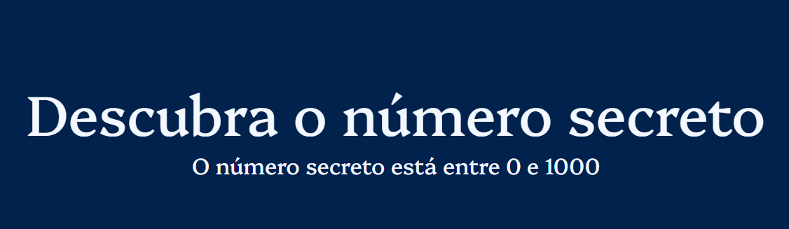
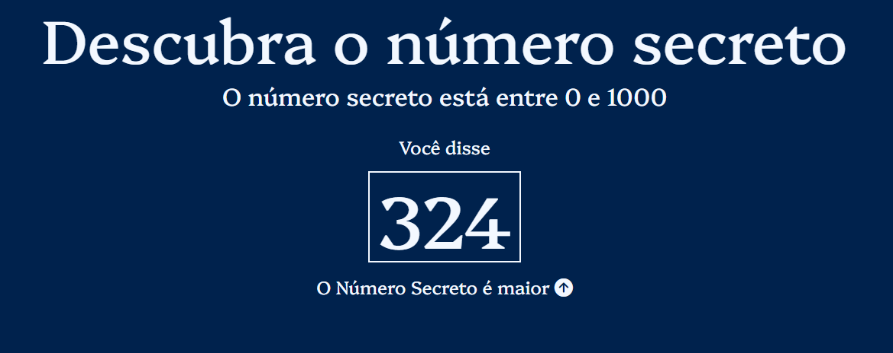
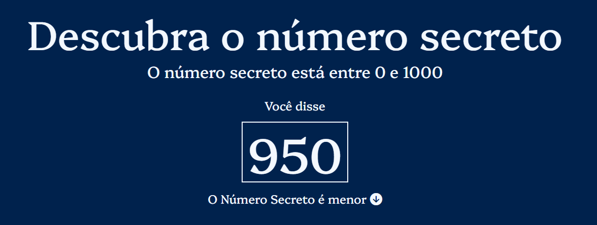
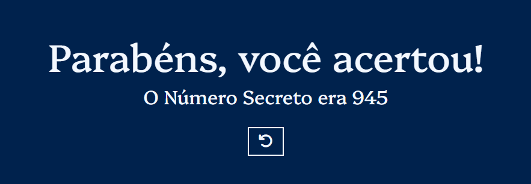

## 🎲 Jogo do Número Secreto 🔢

Um jogo interativo onde o jogador tenta adivinhar um número secreto com a ajuda de comandos de voz e dicas visuais.

 

## 🚀 Sobre o Projeto

Este projeto foi desenvolvido durante o curso da Alura:

* "JavaScript: validações e reconhecimento de voz"
  
O jogo utiliza **JavaScript, HTML e CSS**, com foco na manipulação de eventos, aplicação de validações e reconhecimento de **comandos de voz** para criar uma experiência interativa.

## 📚 Objetivos do Curso

* Descobrir como aplicar **validações** em seus projeto com JavaScript;
* Criar um projeto com **HTML, CSS e JavaScript** do zero;
* Aprender a utilizar **funções build-in** do JavaScript;
* Aplicar **reconhecimento de voz** com JavaScript;
* Manipular **dados, eventos e elementos** com JavaScript.

## 🛠️ Tecnologias Utilizadas

                                

## 🖼️ Visualização do Projeto

Uma prévia das principais telas do **Jogo do Número Secreto**:

**🌐 Acesse o Projeto Online**

O projeto está disponível para visualização na **Vercel**. Clique no link abaixo para acessar:

**🎮 Tela Inicial do Jogo**

Interface principal onde o jogador inicia a partida.

**🗣️ Reconhecimento de Voz**

Demonstração da funcionalidade de reconhecimento de voz para adivinhar o número.

**✅ Mensagem de Acerto**

Tela exibida quando o jogador acerta o número secreto.

